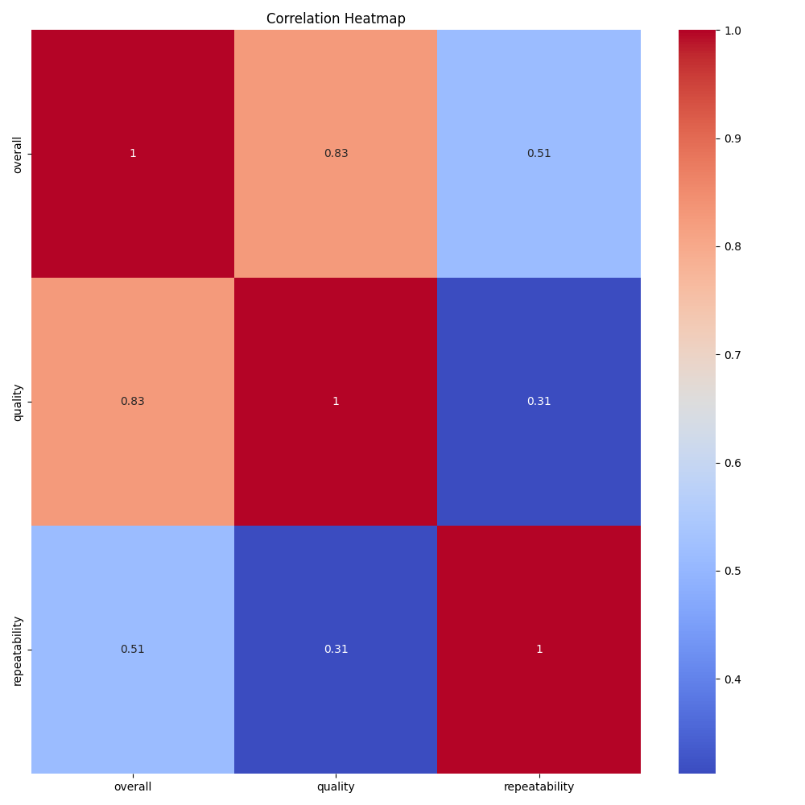
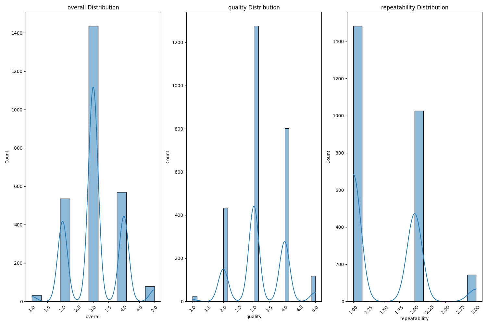

# README.md

## Comprehensive Analysis of Media Ratings Dataset

### 1. Data Overview

The dataset named `media.csv` comprises 2,652 rows and 8 columns, presenting a rich collection of media entities. This dataset is pivotal for understanding media engagement through user ratings. The notable columns include:

- **Numeric Columns**: 
  - `overall`, `quality`, and `repeatability` scores ranging from 1 to 5 and 1 to 3 respectively.
- **Categorical Columns**: 
  - `date`, `language`, `type`, `title`, and `by`, showcasing a diverse dataset with varied media representation.

The initial analysis reveals that while there are minor missing values (primarily in the `date` and `by` columns), much can be learned about the engagement and preferences surrounding various media types.

### 2. Key Insights

- **Ratings Analysis**:
  - A majority of the scores cluster around mid-values, indicating overall accepted media, but with lesser enthusiasm regarding their repeatability.
  - The correlation between `overall` and `quality` is strong (0.83), suggesting that improvements in media quality likely lead to higher overall ratings.

- **Audience Segmentation**:
  - Language diversity (with English and Tamil being principal) and media type (dominated by fiction and movies) inform marketing strategies.

- **Content Improvement Opportunities**:
  - Analysis of poorly rated titles can guide creators in improving areas of discontent, especially where respondents rated quality at the lower end.

### 3. Actionable Recommendations

- **Enhance Content Quality**:
  Focus on improving elements in media that have been rated poorly, particularly in terms of quality and repeatability. Engaging with user feedback on rated titles may lead to more favorable outcomes.

- **Refine Marketing Strategies**:
  Utilize insights from the language and media type analysis to tailor promotions and campaigns that resonate with specific demographic groups.

- **Address Missing Values**:
  Rectifying the missing data pertaining to dates and contributors will enhance the dataset, making it more robust for future analyses.

### 4. Visualizations

The following visualizations provide additional insights into the dataset:

#### Correlation Heatmap


This heatmap visualizes the strong positive correlation between `overall` and `quality`, coupled with moderate correlations with `repeatability`.

#### Distribution Plots


The distribution plots illustrate how scores are concentrated around certain values in `overall` and `quality`, while repeatability ratings tend to skew lower.

### 5. Generated Code for Analysis

The code below was used to conduct the analysis and generate insights, confirming its suitability through regression analysis, clustering, and outlier detection:

```python
import pandas as pd
import numpy as np
import seaborn as sns
import matplotlib.pyplot as plt
from sklearn.ensemble import RandomForestRegressor
from sklearn.cluster import KMeans

# Load the dataset
df = pd.read_csv('media.csv')

# Outlier Detection using IQR
for col in ['overall', 'quality', 'repeatability']:
    Q1 = df[col].quantile(0.25)
    Q3 = df[col].quantile(0.75)
    IQR = Q3 - Q1
    lower_bound = Q1 - 1.5 * IQR
    upper_bound = Q3 + 1.5 * IQR
    df[col + '_outliers'] = ((df[col] < lower_bound) | (df[col] > upper_bound))

# Clustering using KMeans
features = df[['overall', 'quality', 'repeatability']]
kmeans = KMeans(n_clusters=3)
df['cluster'] = kmeans.fit_predict(features)

# Visualization of Outliers
plt.figure(figsize=(12, 6))
sns.boxplot(data=df[['overall', 'quality', 'repeatability']])
plt.title('Boxplot for Overall, Quality, and Repeatability')
plt.savefig('boxplot_outliers.png')
plt.close()

# Regression Analysis
X = df[['quality', 'repeatability']]
y = df['overall']
model = RandomForestRegressor(n_estimators=100)
model.fit(X, y)
importance = model.feature_importances_

# Feature Importance Visualization
plt.figure(figsize=(8, 4))
plt.barh(['Quality', 'Repeatability'], importance)
plt.title('Feature Importance for Predicting Overall Rating')
plt.xlabel('Importance')
plt.savefig('feature_importance.png')
plt.close()

# Time Series Analysis
df['date'] = pd.to_datetime(df['date'], format='%d-%b-%y')
df.groupby(df['date'].dt.to_period('M'))['overall'].mean().plot()
plt.title('Monthly Average of Overall Ratings')
plt.xlabel('Date')
plt.ylabel('Average Overall Rating')
plt.savefig('time_series_analysis.png')
plt.close()
```

This comprehensive analysis reveals valuable insights into media engagement, providing pathways for improving content quality and tailored marketing strategies. The visualizations effectively enhance the understanding of relationships between scored attributes.