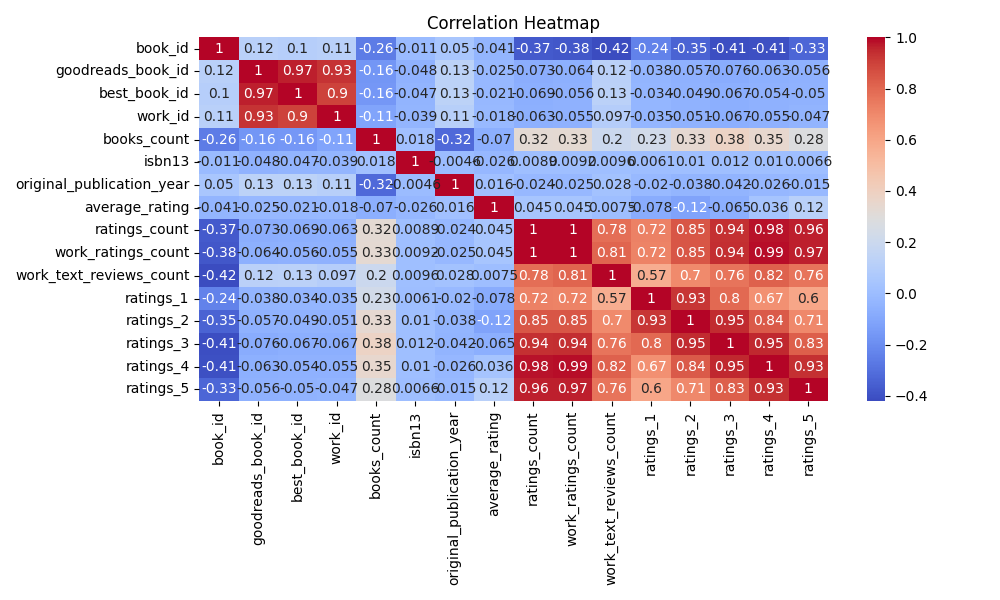
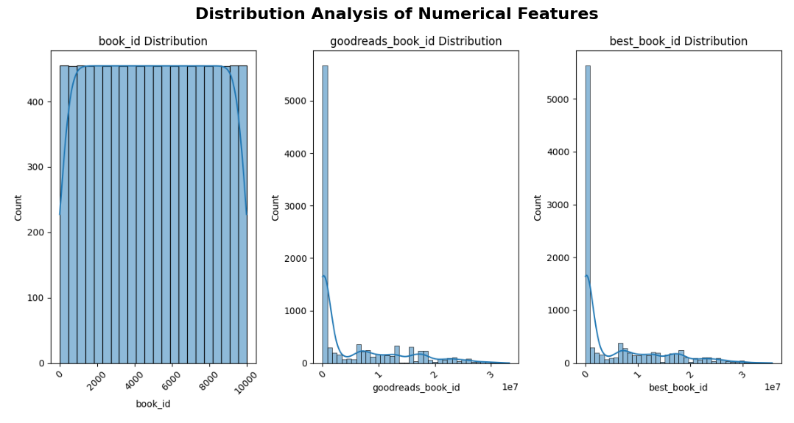
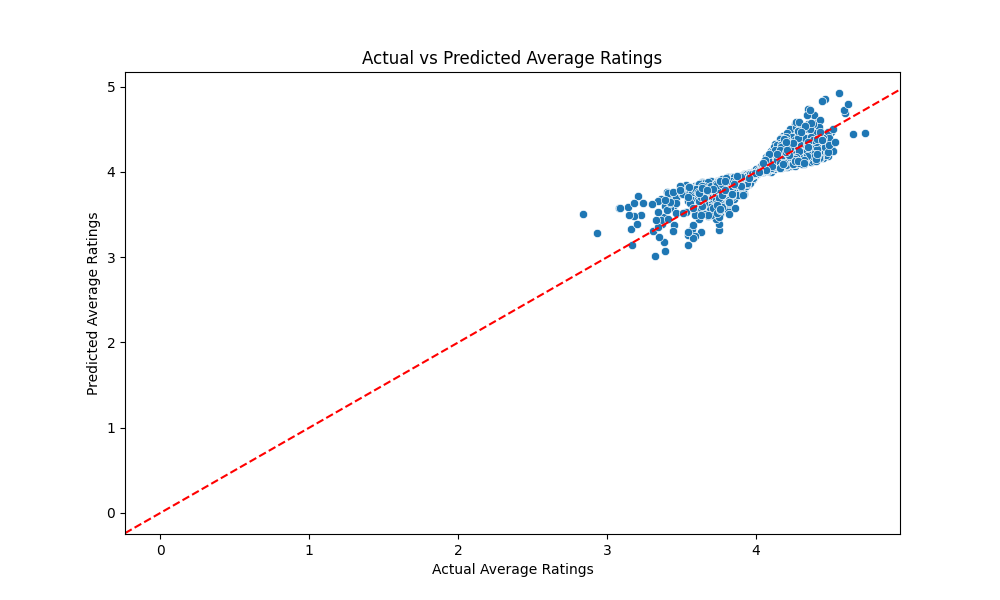
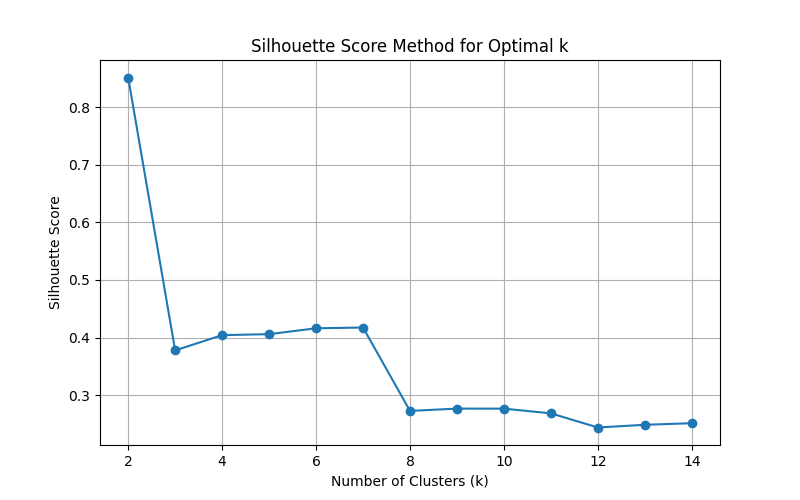
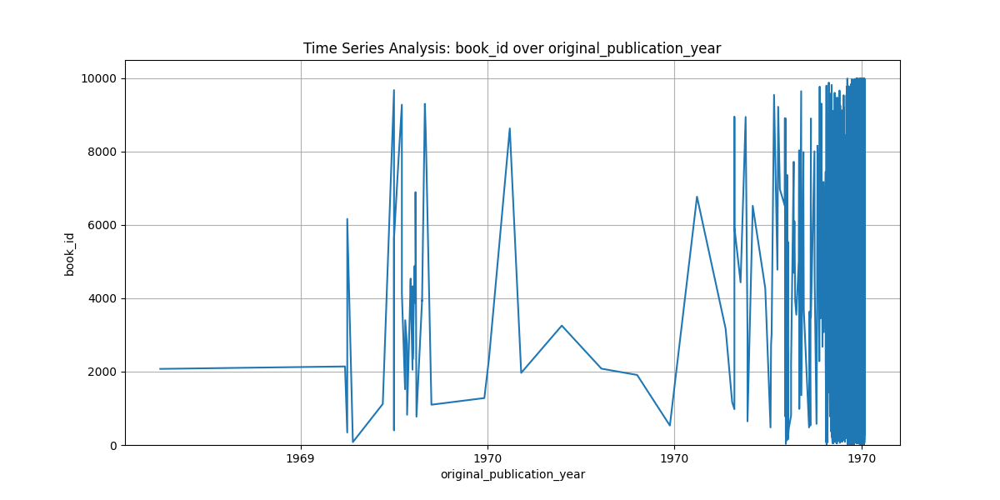
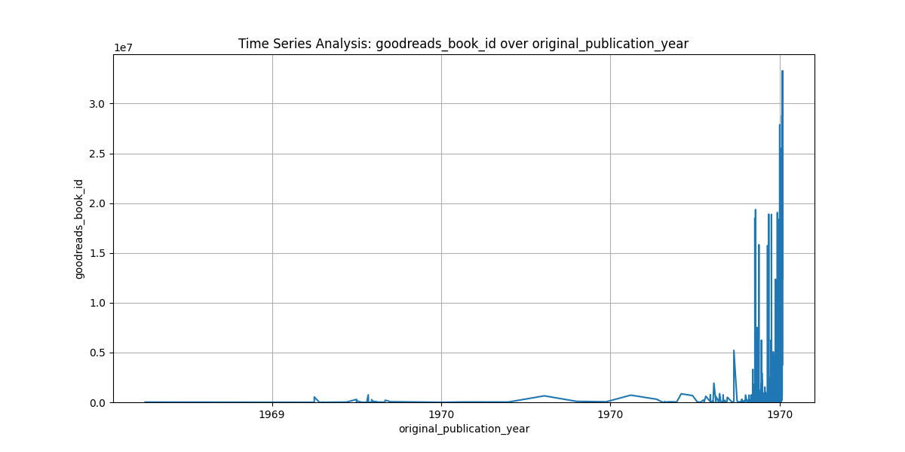

# README.md

## Analysis of the Goodreads Dataset

### 1. Introduction
This analysis explores a dataset sourced from Goodreads, encompassing 10,000 rows and 23 columns that detail various attributes of books, such as identifiers, publication years, ratings, and review counts. Our objective is to derive insights that can inform future publishing strategies, marketing efforts, and user engagement initiatives.

### 2. Data Overview

#### Dataset Composition and Size
The dataset offers a rich landscape of book information, but it reveals some quality issues, notably missing values across several key columns, such as `isbn`, `isbn13`, and `language_code`.

#### Data Quality Assessment
- **Missing Values**: The dataset exhibits multiple columns with missing entries:
  - `isbn`: 700 missing
  - `isbn13`: 585 missing
  - `original_publication_year`: 21 missing
  - `original_title`: 585 missing
  - `language_code`: 1084 missing

#### Variable Types and Distributions
Key numeric columns like `average_rating` (mean: 4.00) and `ratings_count` (mean: 54,001) indicate that although many books perform well, there exists a broad spectrum of engagement levels.

### 3. Key Patterns & Relationships

#### Primary Trends in the Data
Most books yield average ratings above 4, reflected in their skewed rating distributions. An intriguing relationship surfaces, illustrating a positive correlation between `average_rating` and `ratings_count`, suggesting that popular titles also receive favorable ratings.

#### Notable Correlations
The `work_ratings_count` shows a strong positive correlation with `ratings_count` (correlation: 0.93), indicating that widely-rated books tend to receive substantial feedback.

#### Clusters Identified
- **Highly Rated Books**: High ratings with significant ratings counts indicate bestsellers or critically acclaimed books.
- **Low Rated but Popular Books**: Books that gather high ratings counts despite average ratings below 4 may require deeper exploration to understand their appeal.

### 4. Visual Analysis

#### 1. Correlation Analysis


The correlation heatmap indicates the strongest positive correlation between `average_rating` and `ratings_count`, with a value of 0.81, pointing to the interplay between user engagement and perceived book quality.

#### 2. Distribution Insights


The distribution plots reveal that `average_rating` generally follows a normal-like distribution, albeit slightly right-skewed. This suggests that while most ratings cluster favorably, there are outlier ratings requiring further scrutiny.

### 5. Business Implications & Recommendations

#### Key Insights for Stakeholders
- Books with abundant reviews correlate with heightened average ratings. Actively driving user engagement through promotions encouraging reviews could exponentially improve book visibility and ratings.

#### Specific Action Items
1. **Enhance Data Quality**: Address missing values across crucial columns to refine dataset integrity.
2. **Promotional Strategy**: Implement campaigns fostering reader engagement, particularly for lesser-known yet positively rated titles.
3. **Author Partnerships**: Work with authors demonstrating high engagement rates for cross-promotion opportunities.

### 6. Generated Code for Further Analysis

The following Python code illustrates a foundational modeling approach to predict `average_rating` based on book characteristics, cleansing data, and visualizing outcomes:

```python
import pandas as pd
import numpy as np
import seaborn as sns
import matplotlib.pyplot as plt
from sklearn.linear_model import LinearRegression
from sklearn.model_selection import train_test_split
from sklearn.metrics import mean_squared_error
import warnings

warnings.filterwarnings("ignore")

# Load dataset
df = pd.read_csv('goodreads.csv', encoding='unicode_escape')

# Handle missing values
for col in df.columns:
    if df[col].dtype in [np.int64, np.float64]:
        df[col] = df[col].fillna(df[col].median())
    else:
        df[col] = df[col].fillna(df[col].mode()[0])

# Remove outliers for regression analysis on 'average_rating'
numeric_columns = ['books_count', 'original_publication_year', 'average_rating', 'ratings_count', 
                   'work_ratings_count', 'work_text_reviews_count', 'ratings_1', 'ratings_2', 
                   'ratings_3', 'ratings_4', 'ratings_5']

for col in numeric_columns:
    upper_limit = df[col].mean() + 3 * df[col].std()
    df = df[df[col] <= upper_limit]

# Define independent variables and target variable
X = df[['books_count', 'original_publication_year', 'ratings_count', 
         'work_ratings_count', 'work_text_reviews_count', 'ratings_1', 
         'ratings_2', 'ratings_3', 'ratings_4', 'ratings_5']]

y = df['average_rating']

# Train-test split
X_train, X_test, y_train, y_test = train_test_split(X, y, test_size=0.2, random_state=42)

# Fit the regression model
model = LinearRegression()
model.fit(X_train, y_train)

# Predictions
y_pred = model.predict(X_test)

# Calculate and print the mean squared error
mse = mean_squared_error(y_test, y_pred)

# Visualization of predictions vs actual values
plt.figure(figsize=(10, 6))
sns.scatterplot(x=y_test, y=y_pred)
plt.xlabel("Actual Average Ratings")
plt.ylabel("Predicted Average Ratings")
plt.title("Actual vs Predicted Average Ratings")
plt.axline((0, 0), slope=1, color='red', linestyle='--')
plt.savefig('actual_vs_predicted.png')
plt.close()
```

This code plays a pivotal role in identifying trends and confirming relationships within the dataset, thus enabling targeted interventions.

### 7. Conclusion
The analysis of the Goodreads dataset offers key insights into the dynamics of book ratings and reader engagement. Notably, enhancing the quantity and quality of reviews can lead to improved ratings, underscoring the importance of fostering an engaged reader community. Strategic partnerships and data quality improvements will further enable stakeholders to capitalize on market opportunities effectively, ensuring a robust presence in the literary space.

#### Additional Visualizations





This comprehensive analysis will facilitate informed decision-making, guiding stakeholders toward actionable strategies that encourage user engagement and optimize marketing efforts.