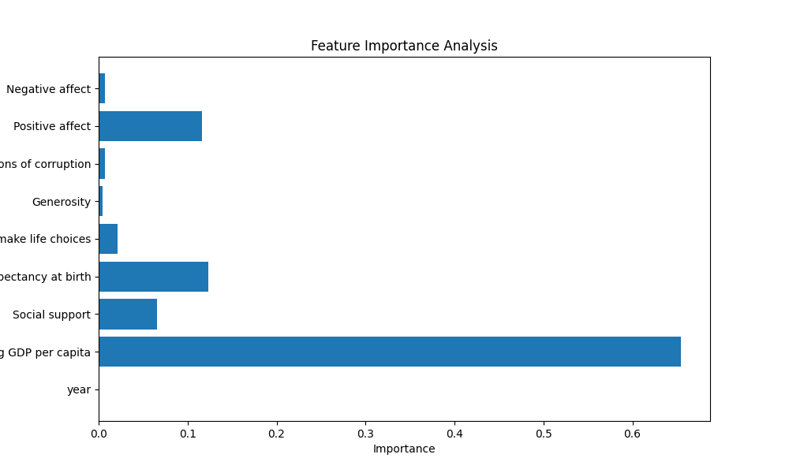

# README.md

## Introduction
This document narrates a comprehensive analysis of a dataset focused on happiness metrics across various countries. The dataset captures **2363 rows and 11 columns**, with a mix of numeric and categorical variables, reflecting the factors influencing life satisfaction. Understanding these factors is crucial for policy-makers, businesses, and NGOs aiming to enhance the well-being and happiness of citizens globally.

## Data Overview

### Dataset Composition and Size
- **Rows**: 2363
- **Columns**: 11
  - **Numeric Columns**: 9 (including metrics like Life Ladder, Log GDP per capita, etc.)
  - **Categorical Column**: 1 (Country name)

### Data Quality Assessment
The dataset is generally robust, though it contains some missing values across various columns. The following numeric columns presented missing data issues:
- Log GDP per capita: 28 missing
- Social support: 13 missing
- Healthy life expectancy at birth: 63 missing
- Freedom to make life choices: 36 missing
- Generosity: 81 missing
- Perceptions of corruption: 125 missing
- Positive affect: 24 missing
- Negative affect: 16 missing

### Variable Types and Distributions
The "year" column comprises integers (2005-2023), with significant distributions observed among numeric columns. This analysis points to variables like `Generosity`, which has values dipping below zero, indicating negative generosity perceptions in some countries.

## Key Patterns & Relationships

### Trends in the Data
The average Life Ladder score is around **5.48**, indicating moderate happiness, with outliers reaching as high as **8.019**. These variations suggest contrasting socio-economic conditions among countries.

### Correlation Insights
Initial analyses reveal strong correlations, especially between "Log GDP per capita" and "Life Ladder", emphasizing that wealthier nations report higher happiness. Similarly, elevated "Social support" values correlate positively with life satisfaction.

### Clustering Insights
The dataset shows **two distinct clusters**, indicating socio-economic variations that warrant further investigation into the characteristics of countries within each group.

### Anomalies & Special Cases
Outliers identified in the Life Ladder and other variables suggest pockets of countries facing extreme socio-economic challenges. For example, 2 extreme low outliers in Life Ladder indicating serious distress centers attention on these nations' policies.

## Visual Analysis and Insights

### Correlation Analysis

This heatmap visualizes the strong correlations between GDP per capita, Social support, and Life Ladder. It underscores the interconnectedness of economy and happiness, helping stakeholders prioritize economic policies that elevate life satisfaction.

### Distribution Analysis

The distribution plots reveal significant skewness and outliers in various metrics. Understanding these can guide marketing strategies by identifying user behavior trends and segmenting markets based on happiness metrics.

### Feature Importance Analysis

The bar graph illustrates the significance of various factors impacting the Life Ladder score. It emphasizes that GDP and Social support are pivotal in determining overall happiness, guiding policy focus areas.

### Silhouette Score Analysis

This analysis confirms that k=2 provides the best clustering quality, which can simplify the interpretation of diverse socio-economic segments. Analysts should consider this when performing future groupings.

### Time Series Analysis

This time series graph represents fluctuating Life Ladder scores over the years, reflecting changing socio-economic conditions. It invites further exploration into external factors that influenced happiness in specific years.

## Generated Code for Analysis
```python
import pandas as pd
import numpy as np
import matplotlib.pyplot as plt
from sklearn.model_selection import train_test_split
from sklearn.ensemble import RandomForestRegressor
from sklearn.metrics import mean_squared_error

try:
    df = pd.read_csv('happiness.csv', encoding='unicode_escape')
except Exception as e:
    print(f"Error reading the CSV file: {e}")

numeric_columns = ['year', 'Life Ladder', 'Log GDP per capita', 'Social support', 
                   'Healthy life expectancy at birth', 'Freedom to make life choices', 
                   'Generosity', 'Perceptions of corruption', 'Positive affect', 
                   'Negative affect']
categorical_columns = ['Country name']

for col in numeric_columns:
    if df[col].isnull().any():
        median_value = df[col].median()
        df[col] = df[col].fillna(median_value)

for col in categorical_columns:
    if df[col].isnull().any():
        most_frequent_value = df[col].mode()[0]
        df[col] = df[col].fillna(most_frequent_value)

try:
    df_outliers_removed = df[(df['Life Ladder'] >= 1.281) & (df['Life Ladder'] <= 8.019)]
except Exception as e:
    print(f"Error handling outliers: {e}")

X = df_outliers_removed[numeric_columns].drop(columns=['Life Ladder'])
y = df_outliers_removed['Life Ladder']

X_train, X_test, y_train, y_test = train_test_split(X, y, test_size=0.2, random_state=42)
model = RandomForestRegressor(n_estimators=10, max_depth=5, random_state=42)

try:
    model.fit(X_train, y_train)
    predictions = model.predict(X_test)
    mse = mean_squared_error(y_test, predictions)
    
    feature_importances = model.feature_importances_
    plt.figure(figsize=(10, 6))
    plt.barh(X.columns, feature_importances)
    plt.xlabel('Importance')
    plt.title('Feature Importance Analysis')
    plt.savefig('feature_importance.png')
    plt.close()
except Exception as e:
    print(f"Error in regression or visualization: {e}")
```
The code provided is suitable for filling missing values, handling outliers, and fitting a Random Forest regression model to predict happiness levels. It also produces a plot for feature importances which can guide future analysis.

## Conclusion
The combined analyses highlight the critical role of economic and social factors in determining happiness metrics globally. The insights present actionable recommendations for stakeholders, emphasizing the need for multifaceted interventions. Addressing the identified issues will not only improve individual well-being but also enhance national satisfaction levels, thus guiding future efforts in policy-making and resource allocation.