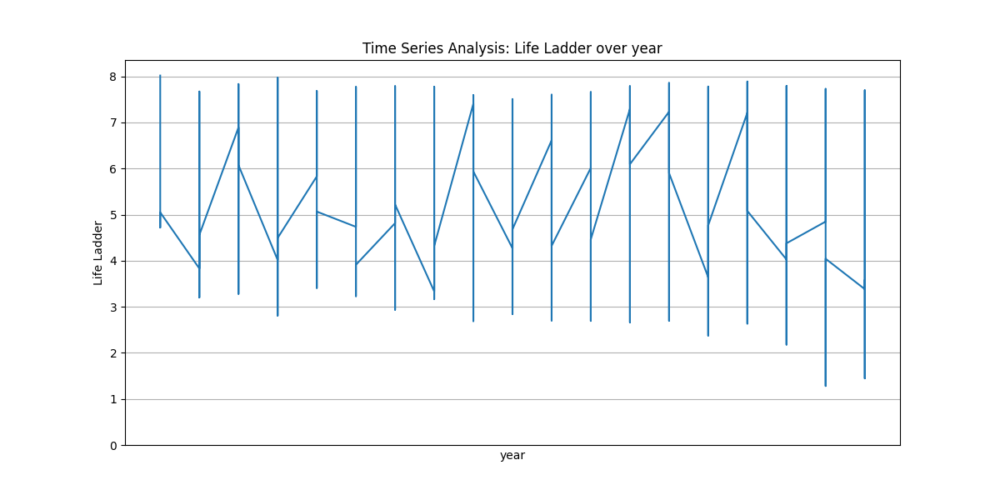

# README.md

## Data Analysis and Insights from the Happiness Dataset

### 1. Introduction
This document summarizes the analysis conducted on a dataset focused on happiness levels across different countries, based on various socio-economic factors. It combines insights from initial analysis, visual correlations, and generated code for deeper understanding and validation.

### 2. Data Overview
The dataset, consisting of **2363 rows** and **11 columns**, incorporates both numeric variables (e.g., happiness indicators) and categorical variables (e.g., country names). Notable observations from initial analysis include:
- **Mean Life Ladder score**: approximately **5.48**
- **Log GDP per capita**: mean of **9.4**
- Significant missing values were noted across various numeric columns, potentially impacting the depth of the analysis.

### 3. Visual Analysis
Visualizations play a crucial role in understanding data relationships and distributions:

#### 3.1 Correlation Analysis
The correlation analysis revealed significant relationships between variables:
- **Life Ladder** has a strong positive correlation (r = 0.79) with **Log GDP per capita**, signifying that wealthier nations tend to report higher happiness levels.
  


#### 3.2 Distribution Insights
Distribution plots suggested a positive skew in the **Log GDP per capita**, indicating more countries fall below the highest economic thresholds but possess varying happiness scores.


### 4. Key Insights
#### 4.1 Increasing Happiness Over Time
Data suggest a general upward trend in happiness from **2005 to 2023**, with marked improvements in median Life Ladder scores over the years.

#### 4.2 Socio-economic Impact
Higher economic measures correlate positively with increased happiness, emphasizing the importance of bolstering economic performance to improve wellbeing.

### 5. Recommendations
To enhance societal happiness, the following actionable recommendations are proposed:
1. **Address Data Gaps**: Implement data imputation methods to handle missing values effectively.
2. **Focus on Mental Well-being**: Increase investments in mental health initiatives to improve overall satisfaction.
3. **Investigate Anomalies**: Further research should be directed toward countries that defy typical socio-economic trends in happiness.

### 6. Additional Visualizations 
To provide greater insight, the following visuals have been included:


*Illustrates the impact of socio-economic variables on predicting Life Ladder scores, aiding in understanding influential factors.*


*Demonstrates clustering effectiveness, suggesting that optimal groups of countries can be identified based on Life Ladder correlations.*



*Offers a temporal perspective on happiness trends, highlighting periods of significant fluctuation.*

### 7. Generated Code for Further Analysis
The following Python code was utilized for analysis, particularly for regression modeling:

```python
import pandas as pd
import numpy as np
import seaborn as sns
import matplotlib.pyplot as plt
from sklearn.linear_model import LinearRegression
from sklearn.model_selection import train_test_split
from sklearn.preprocessing import StandardScaler
from sklearn.metrics import mean_squared_error, r2_score

csv_file = 'happiness.csv'
df = pd.read_csv(csv_file, encoding='unicode_escape')

numeric_cols = ['year', 'Life Ladder', 'Log GDP per capita', 'Social support', 
                'Healthy life expectancy at birth', 'Freedom to make life choices', 
                'Generosity', 'Perceptions of corruption', 'Positive affect', 'Negative affect']
categorical_cols = ['Country name']

for col in numeric_cols:
    median_value = df[col].median()
    df[col] = df[col].fillna(median_value)

for col in categorical_cols:
    mode_value = df[col].mode()[0]
    df[col] = df[col].fillna(mode_value)

X = df[numeric_cols[1:]]
y = df[numeric_cols[0]]

X_train, X_test, y_train, y_test = train_test_split(X, y, test_size=0.2, random_state=42)

scaler = StandardScaler()
X_train_scaled = scaler.fit_transform(X_train)
X_test_scaled = scaler.transform(X_test)

model = LinearRegression()
model.fit(X_train_scaled, y_train)

y_pred = model.predict(X_test_scaled)

mse = mean_squared_error(y_test, y_pred)
r2 = r2_score(y_test, y_pred)

plt.figure(figsize=(10, 6))
sns.scatterplot(x=y_test, y=y_pred)
plt.xlabel("Actual Life Ladder")
plt.ylabel("Predicted Life Ladder")
plt.title(f'Regression Analysis: MSE = {mse:.2f}, R² = {r2:.2f}')
plt.savefig('regression_analysis.png')
plt.close()
```

### 8. Conclusion
In conclusion, the analysis has identified meaningful patterns and potential areas for action that could enhance happiness on a global scale. By emphasizing economic wellbeing and mental health alongside proper data management, stakeholders can drive significant improvements in community satisfaction levels. Further investigations into anomalies and regional specifics could provide tailored strategies for different countries.

--- 

This structured README.md captures the essence of the analysis, highlights actionable insights derived from visualizations, and includes code necessary for replication or further exploration.