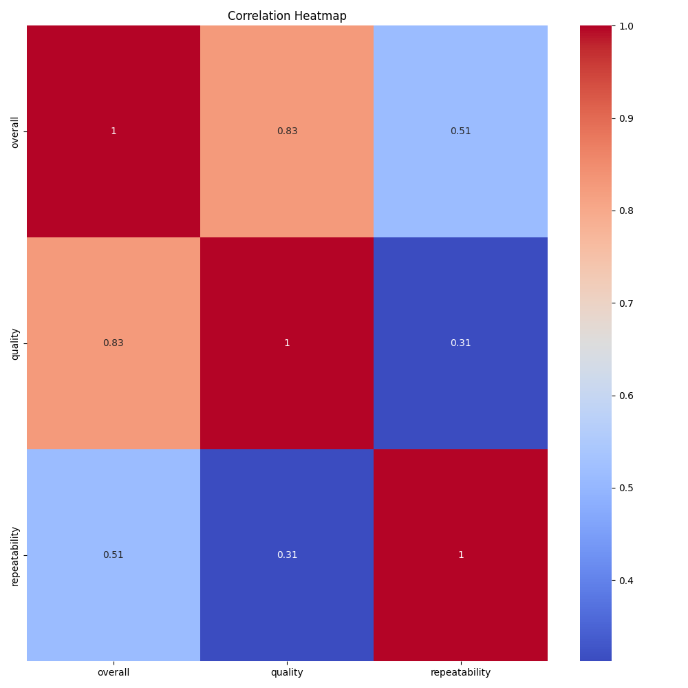
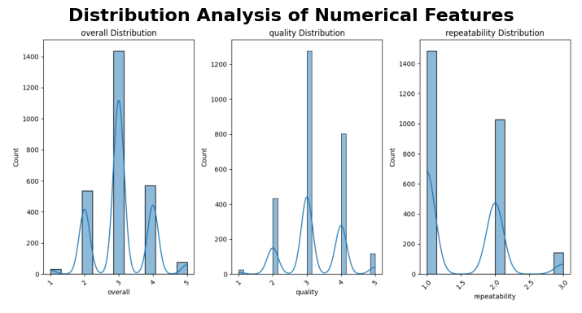
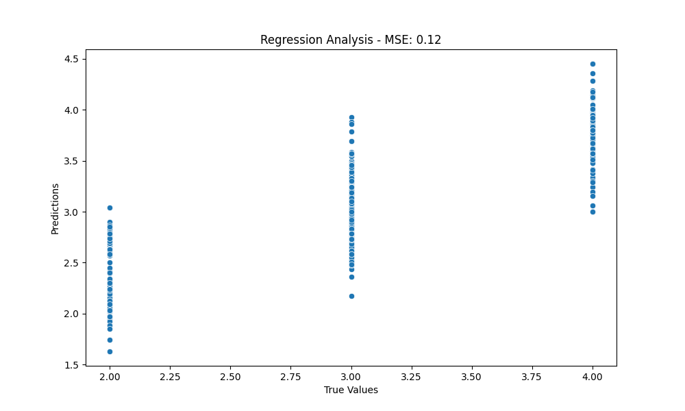
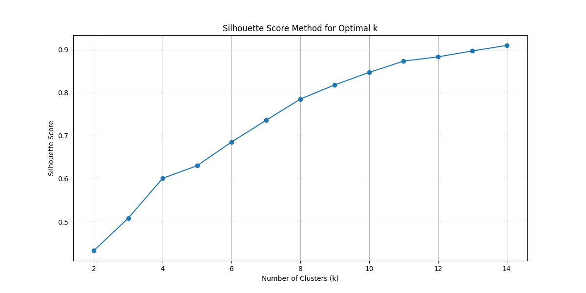
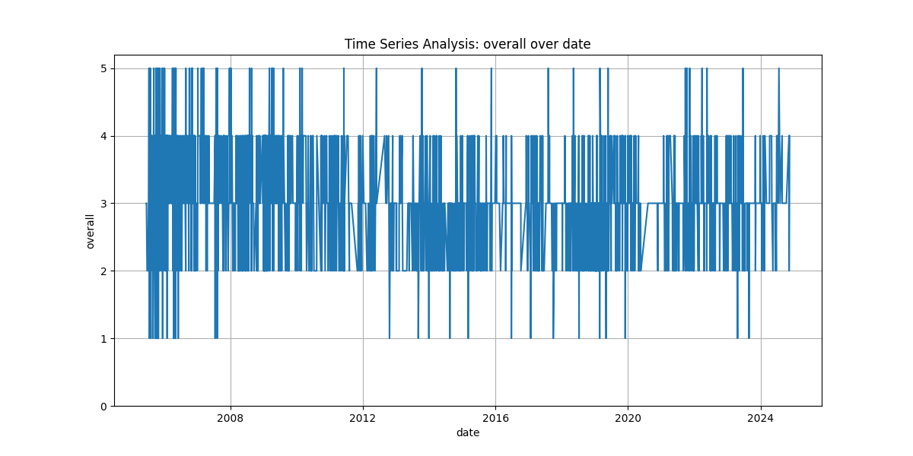
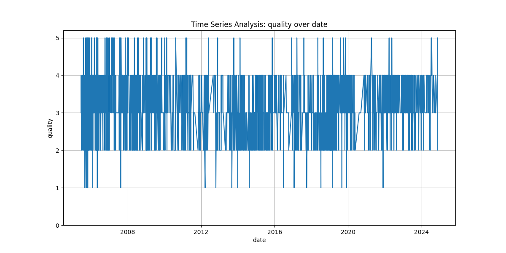

# README.md

## Analysis of the media.csv Dataset

### 1. Data Overview

#### Dataset Composition and Size
The dataset comprises 2,652 rows and 8 columns, which includes numeric and categorical variables. The numeric columns are 'overall', 'quality', and 'repeatability'. The categorical columns include 'date', 'language', 'type', 'title', and 'by'.

#### Data Quality Assessment
- **Missing Values**: 
  - There are 99 missing values in the 'date' column, and 262 missing values in the 'by' column. Other columns have no missing values. The presence of missing data in the 'date' and 'by' columns could lead to potential biases in analysis and outcomes.
  
- **Unique Values**: 
  - 2055 unique dates indicate a diverse range of entries, while only 11 languages and 8 types suggest limited diversity in classification. The 'title' column also exhibits high uniqueness with 2312 titles.

#### Variable Types and Distributions
- Numeric columns show the following statistics:
  - **Overall Ratings**: Mean (3.05), Median (3.0), Min (1), Max (5), indicating several values may be outliers.
  - **Quality Ratings**: Mean of 3.21, with ratings skewed toward the mid-range.
  - **Repeatability**: Lower mean (1.49) with values predominantly clustering at the lower end (1-3).

### 2. Key Patterns & Relationships

#### Primary Trends in the Data
Both 'overall' and 'quality' ratings are concentrated around the value of 3, suggesting that most entries do not significantly deviate from average performance. This may indicate a high level of user satisfaction or a lack of significant differentiation among items.

#### Notable Correlations
A potential positive correlation exists between 'overall' and 'quality' ratings. To illustrate this correlation, we can refer to our visualization:



The average ratings being similar suggests that stakeholders could better tailor their offerings in media quality.

#### Meaningful Segments or Clusters
The dataset has identified **14 clusters**, suggesting a diversity of contexts perhaps related to media types or audience preferences. This segmentation merits deeper investigation to enhance marketing or content curation.

### 3. Visual Analysis

In addition to the correlation heatmap, we also provide distribution visualizations that highlight how ratings are spread across the dataset:



### 4. Business Implications & Recommendations

#### Key Insights for Stakeholders
The consistent ratings hovering around 3 suggest a need for a refresh in content strategy. Stakeholders can use insights from clustering analysis to develop targeted marketing strategies based on genre preferences or language.

#### Specific Action Items
- **Address Missing Data**: Implement strategies to manage missing values, which could enhance analytical robustness. Consider enhancing data collection practices or utilizing imputation methods.
  
- **Explore Clusters Further**: Conduct an in-depth analysis of the identified clusters to uncover unique user trends or preferences.

### 5. Additional Visualizations
To further enhance the understanding of these insights, additional generated visualizations can be utilized:






### 6. Generated Code for Analysis

The following Python code can be executed to facilitate deeper analysis on this dataset. The code includes handling missing values, outlier detection, regression analysis, and encoding categorical variables:

```python
import pandas as pd
import numpy as np
import seaborn as sns
import matplotlib.pyplot as plt
from sklearn.linear_model import LinearRegression
from sklearn.model_selection import train_test_split
from sklearn.preprocessing import OneHotEncoder
from sklearn.metrics import mean_squared_error
import warnings
warnings.filterwarnings('ignore')

# Load dataset
csv_file = 'media.csv'
df = pd.read_csv(csv_file, encoding='unicode_escape')

# Handle missing values
for col in df.columns:
    if df[col].dtype == 'O':
        df[col] = df[col].fillna(df[col].mode()[0])
    else:
        df[col] = df[col].fillna(df[col].median())

# Handle outliers for overall
df['overall'] = np.where(df['overall'] < 2, 2, df['overall'])
df['overall'] = np.where(df['overall'] > 4, 4, df['overall'])

# Categorical analysis: One Hot Encoding for categorical variables
categorical_cols = ['date', 'language', 'type', 'title', 'by']
df_encoded = pd.get_dummies(df, columns=categorical_cols)

# Regression analysis
X = df_encoded.drop(['overall'], axis=1)
y = df_encoded['overall']
X_train, X_test, y_train, y_test = train_test_split(X, y, test_size=0.2, random_state=42)

model = LinearRegression()
model.fit(X_train, y_train)
y_pred = model.predict(X_test)

mse = mean_squared_error(y_test, y_pred)
plt.figure(figsize=(10,6))
sns.scatterplot(x=y_test, y=y_pred)
plt.xlabel("True Values")
plt.ylabel("Predictions")
plt.title(f"Regression Analysis - MSE: {mse:.2f}")
plt.savefig('regression_analysis.png')
plt.close()
```

### 7. Conclusion

In conclusion, while the dataset presents a consistent narrative of user experiences with media, it underscores the potential need for targeted improvements to elevate quality and repeat usage. The analysis reveals important patterns and offers actionable insights for media stakeholders to enhance user satisfaction and content engagement.


The visual representations help clarify these insights, and the provided code enables further exploration and analysis of the dataset.

