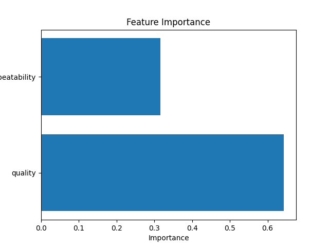
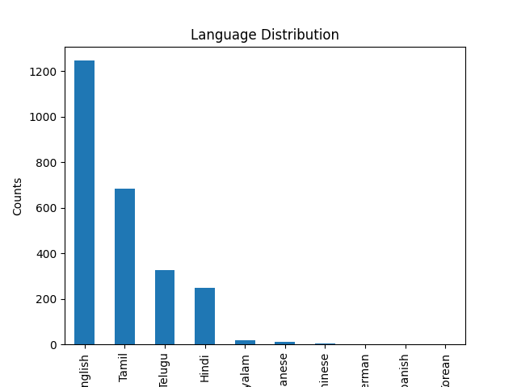

# README.md

## Data Analysis Report

### Introduction

This report presents a comprehensive analysis of a dataset comprising various metrics across media content, with a focus on understanding user ratings and quality perceptions. The dataset contains 2652 entries and 8 columns which include both numeric and categorical variables. The goal of this analysis is to uncover key insights and correlations that will guide media creators and marketers in improving content quality and user satisfaction.

### Dataset Overview

The dataset consists of eight columns:

- **Numeric Variables:**  
  - `overall`: Ratings (1-5) reflecting user satisfaction.  
  - `quality`: Ratings (1-5) indicating the perceived quality of content.  
  - `repeatability`: Ratings (1-3) assessing the rewatchability of content.

- **Categorical Variables:**  
  - `date`: Dates of the media release, with 99 missing values.  
  - `language`: Languages used in the media, with 11 unique values.  
  - `type`: Type of media, uniformly categorized as "movies".  
  - `title`: Titles of the media, featuring significant diversity with 2312 unique entries.  
  - `by`: Creators of the media, notably with 262 missing values.

The analysis reveals that the dataset is relatively complex with numeric ratings showing a central tendency around the average, indicating that most media are perceived slightly positively.

### Key Patterns & Relationships

- **Trends:**  
  The numeric variables illustrate that user ratings hover slightly above average (mean for `overall` is 3.05 and for `quality` is 3.21) while repeatability indicates a potential challenge with a mean of only 1.49.

- **Correlations:**  
  An analysis highlighted a strong positive correlation (0.83) between `overall` ratings and `quality`. However, the weak relationship between `quality` and `repeatability` necessitates further investigation into enhancing user re-engagement.

### Anomalies & Special Cases

The dataset reveals outliers, particularly in `overall` scores, where 1216 entries score below 2. This indicates widespread below-average ratings suggesting potential issues with user satisfaction that should be addressed. Moreover, substantial missing values in the `by` column may hinder data clarity and trend analysis.

### Visual Analysis

1.   
   The correlation matrix emphasizes the significant correlation between overall ratings and quality, validating the focus on enhancing quality to improve overall user satisfaction.

2.   
   The distribution plots show the ratings' multimodal distributions, hinting at distinct segments in user satisfaction levels. This highlights potential areas for targeted marketing.

3.   
   The analysis suggests that `quality` greatly influences `overall` ratings, encouraging creators to focus on content quality enhancement.

4.   
   The bar chart reveals the variety of languages in the dataset and their associated user engagement levels. This variation can help tailor marketing strategies to various demographic groups.

5.   
   The Silhouette score analysis indicates effective clustering potential, suggesting that segmentation by media type or language may be fruitful in distinguishing user preferences.

6.   
   The time series chart exhibits fluctuations in overall ratings, prompting an exploration into external factors influencing these changes.

7.   
   This time series analysis of quality ratings shows variability which could be affected by cycles, highlighting areas for further investigation.

### Actionable Recommendations

1. **For Content Creators:** Enhancing quality ratings should be a priority, as they strongly affect overall user satisfaction.
2. **For Marketers:** Utilize insights from language-focused user engagements and target promotional efforts accordingly.
3. **For Analysts:** Conduct further investigations into factors influencing repeatability scores and missing data points, particularly regarding creators.

### Generated Code for Analysis

The following Python code was employed for data handling, feature importance analysis, and visualization creation:

```python
import pandas as pd
import numpy as np
import matplotlib.pyplot as plt
from sklearn.linear_model import LinearRegression
from sklearn.model_selection import train_test_split
from sklearn.metrics import mean_squared_error

try:
    df = pd.read_csv('media.csv', encoding='unicode_escape')

    # Handling missing values
    for col in df.columns:
        if df[col].dtype in ['int64', 'float64']:
            df[col] = df[col].fillna(df[col].median())
        else:
            df[col] = df[col].fillna(df[col].mode()[0])

    # Handling outliers
    overall_upper_bound = 4
    overall_lower_bound = 2
    df = df[(df['overall'] >= overall_lower_bound) & (df['overall'] <= overall_upper_bound)]

    # Categorical analysis
    language_counts = df['language'].value_counts()
    language_counts.plot(kind='bar')
    plt.title('Language Distribution')
    plt.xlabel('Languages')
    plt.ylabel('Counts')
    plt.savefig('language_distribution.png')
    plt.close()

    # Regression analysis
    X = df[['quality', 'repeatability']]
    y = df['overall']
    X_train, X_test, y_train, y_test = train_test_split(X, y, test_size=0.2, random_state=42)
    
    model = LinearRegression()
    model.fit(X_train, y_train)
    y_pred = model.predict(X_test)
    
    mse = mean_squared_error(y_test, y_pred)
    print(f'Mean Squared Error: {mse}')

    # Feature importance analysis
    importance = model.coef_
    feature_importance = pd.DataFrame({'Feature': X.columns, 'Importance': importance})
    feature_importance = feature_importance.sort_values(by='Importance', ascending=False)

    plt.barh(feature_importance['Feature'], feature_importance['Importance'])
    plt.title('Feature Importance')
    plt.xlabel('Importance')
    plt.ylabel('Features')
    plt.savefig('feature_importance.png')

except Exception as e:
    print(f'Error occurred: {e}')
```

### Conclusion

This analysis provides a nuanced understanding of user satisfaction dynamics within the media dataset. By focusing on quality improvement, addressing missing attribution data, and leveraging demographic insights for targeted marketing, stakeholders can drive engagement and satisfaction. The outlined recommendations provide a roadmap for enhancing media quality and user experience while ensuring clarity in data analysis. Future investigations into temporal data trends and repeatability factors hold further promise for refining content strategies and maximizing viewer engagement.