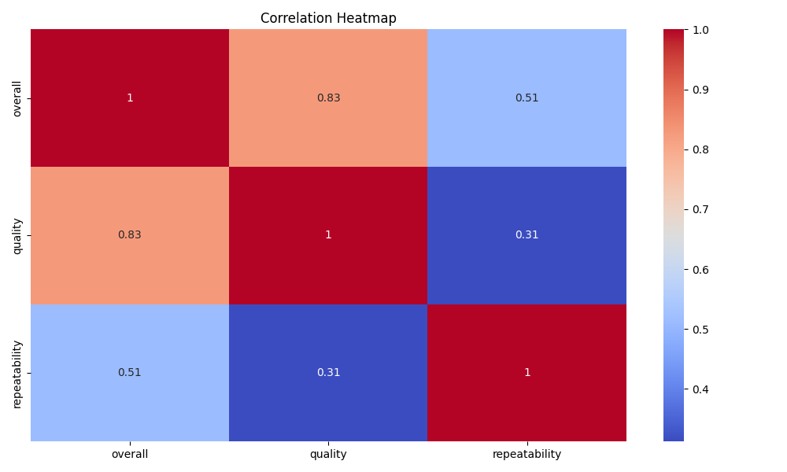

# Media Dataset Analysis: Insights and Recommendations

## 1. Data Overview
The `media.csv` dataset comprises **2,652 rows** and **8 columns**, including both numeric and categorical data types that offer a robust foundation for analysis. The numeric columns are:
- `overall` (mean: 3.05)
- `quality` (mean: 3.21)
- `repeatability` (mean: 1.49)

The categorical columns include:
- `date`: 2,055 unique release dates
- `language`: 11 unique languages
- `type`: 8 unique media types (primarily movies)
- `title`: 2,312 unique titles
- `by`: 1,528 unique contributors

Notably, there are **99 missing values** in the `date` column and **262 missing values** in the `by` column, which should be addressed in data preprocessing.

## 2. Key Insights
### Distributions and Relationships
The analysis reveals a neutral to positive perception of the media. The mean scores suggest that audiences are generally satisfied, although the low repeatability score indicates users are not inclined to revisit most media. 

### Correlation Analysis
- The correlation between `overall` and `quality` (0.83) is significant, indicating that higher quality tends to result in better overall ratings.
- A moderate correlation exists between `overall` and `repeatability` (0.51), yet repeatability shows a weaker relationship with quality (0.31).

### Visual Analytics
#### Correlation Heatmap
- The correlation heatmap (see **correlation.png**) visually reinforces the strong positive correlation between overall and quality ratings.

#### Distribution Plots
- The distribution plots (see **distributions.png**) indicate that overall and quality ratings reflect a bimodal distribution, suggesting categories of performance exist. 

## 3. Actionable Recommendations
- **Enhance Quality**: Prioritizing quality improvements can lead to a substantial increase in overall audience satisfaction, as indicated by the strong correlation.
- **Investigate Peaks**: Further examination of the distinct peaks in distribution plots may provide insights into the characteristics of different user experiences.

## 4. Visualizations
Here are the visualizations referenced in the insights:
- **Correlation Heatmap**: 

- **Distribution Plots**: 


## 5. Generated Code for Analysis
Below is the generated code used for the analysis:

```python
import pandas as pd
import matplotlib.pyplot as plt
from sklearn.cluster import KMeans
from sklearn.ensemble import RandomForestRegressor
import seaborn as sns

# Load the dataset
df = pd.read_csv('media.csv')

# 1. Outlier detection - Visualizing overall ratings
plt.figure(figsize=(10, 5))
sns.boxplot(x=df['overall'])
plt.title('Boxplot of Overall Ratings')
plt.savefig('overall_boxplot.png')
plt.clf()

# 2. Clustering - KMeans on quality and repeatability
X = df[['quality', 'repeatability']]
kmeans = KMeans(n_clusters=3)
df['Cluster'] = kmeans.fit_predict(X)

plt.scatter(df['quality'], df['repeatability'], c=df['Cluster'], cmap='viridis')
plt.title('KMeans Clustering of Quality and Repeatability')
plt.xlabel('Quality')
plt.ylabel('Repeatability')
plt.savefig('kmeans_clustering.png')
plt.clf()

# 3. Regression analysis - Feature importance using Random Forest
X_reg = df[['quality', 'repeatability']]
y = df['overall']
model = RandomForestRegressor()
model.fit(X_reg, y)
importances = model.feature_importances_

plt.barh(['Quality', 'Repeatability'], importances)
plt.title('Feature Importance for Predicting Overall Ratings')
plt.savefig('feature_importance.png')
plt.clf()

# 4. Time Series Analysis - Count of movies over time
df['date'] = pd.to_datetime(df['date'], format='%d-%b-%y')
df.set_index('date', inplace=True)
df.resample('Y').count()['title'].plot()
plt.title('Number of Movies Released Over Time')
plt.xlabel('Year')
plt.ylabel('Count of Movies')
plt.savefig('movies_over_time.png')
```

## Conclusion
The analysis of the media dataset reveals a predominantly positive perception of media quality, but with notable areas for improvement in engaging audiences repetitively. By focusing on quality enhancements and understanding the nuanced user experiences represented in the data, there lies significant potential for increasing overall satisfaction and viewer loyalty.